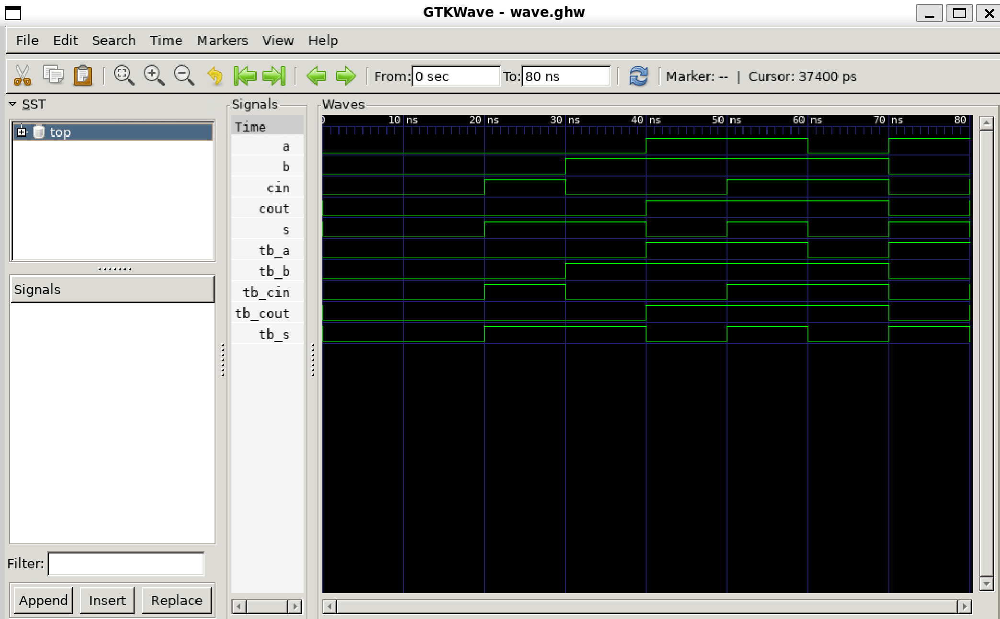

# 32-Bit Carry-Lookahead Adder (CLA) in VHDL

This repository contains the VHDL source code for a 32-bit Carry-Lookahead Adder. The project was developed as part of the Digital System Construction (2060) university course. The design is hierarchical, fully verified through simulation, and structured for clarity and maintainability.

## Key Features
* **32-Bit Addition:** Performs addition on two 32-bit `std_logic_vector` inputs. 
* **High-Speed Architecture:** Implements the Carry-Lookahead algorithm to minimize the propagation delay associated with carry signals, offering a significant performance advantage over a standard Ripple-Carry Adder.
* **Hierarchical Design:** The architecture is modular, built from reusable 1-bit full adders and 4-bit CLA blocks, demonstrating a structured design approach. 
* **Comprehensive Verification:** The design is validated with a self-checking testbench that covers a wide range of test cases, including standard operations, edge cases, and overflow conditions. 

## Architectural Overview
The adder is constructed using three primary components in a hierarchical structure:

1.  **`cla_top.vhd`**: The top-level entity that instantiates and connects eight 4-bit `CLA_block` components to form the 32-bit adder. 
2.  **`cla_block.vhd`**: A 4-bit adder block that contains the core lookahead logic. It generates propagate (`p`) and generate (`g`) signals to compute the carry-out for the block in parallel. 
3.  **`fulladder.vhd`**: A standard 1-bit full adder, which serves as the fundamental building block for the sum calculation within each `CLA_block`. 

A block diagram illustrating this hierarchy would be beneficial for visualizing the design structure.

## Verification
The design was verified using the `tb_cla_top.vhd` testbench. This testbench is self-checking and uses `assert` statements to automatically report failures, ensuring the correctness of the output for various scenarios:
* Simple addition with and without carry-in.
* Addition of large numerical values. 
* Overflow condition (`0xFFFFFFFF` + `1`). 
* Tests with specific bit patterns (`0xAAAAAAAA` + `0x55555555`). 

### Waveform
The following waveform illustrates the overflow test case, where `a = 0xFFFFFFFF`, `b = 0x00000001`, and `cin = '0'`. The result correctly shows `sum = 0x00000000` and `cout = '1'`.



## Potential Improvements
* **Synthesis and Implementation:** The next logical step for this project is to synthesize the design for a target FPGA device (e.g., a Xilinx Artix-7 or Intel Cyclone V). This process would provide key metrics on hardware resource utilization (LUTs, FFs) and timing performance (maximum operating frequency).
* **Pipelining:** To further increase throughput for applications that process continuous data, the adder could be pipelined. This would involve adding registers between the CLA block stages.

## Usage Instructions
1.  **Clone the repository:**
    ```sh
    git clone <your-repo-url>
    ```
2.  **Run Simulation:**
    The VHDL source files are located in the `rtl/` directory, and the corresponding testbenches are in the `sim/` directory. The top-level testbench `tb_cla_top.vhd` can be compiled and run in any standard VHDL simulator, such as GHDL (open-source), ModelSim, or the Xilinx Vivado simulator.